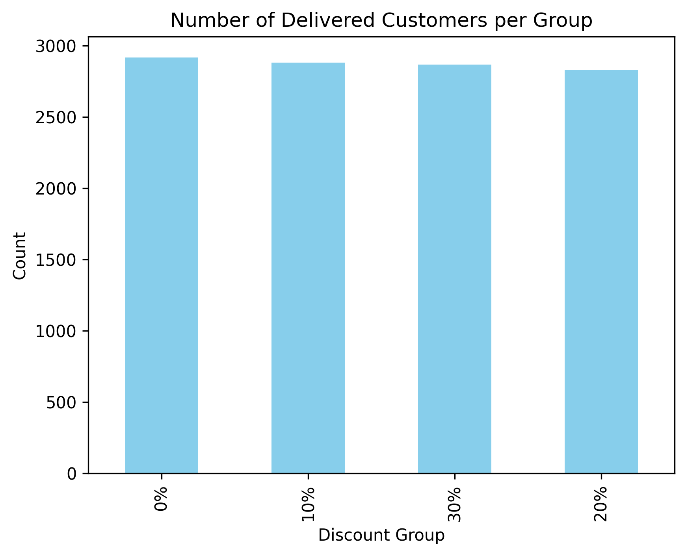
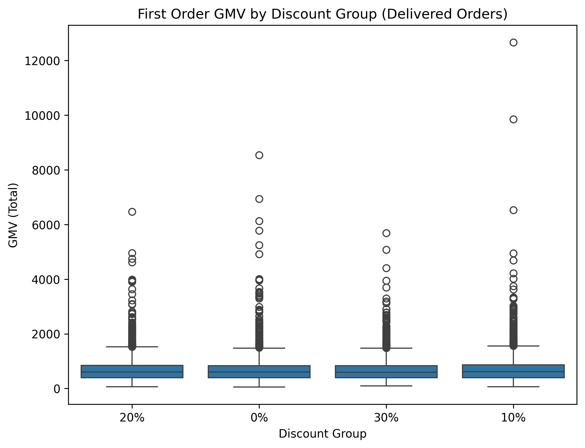
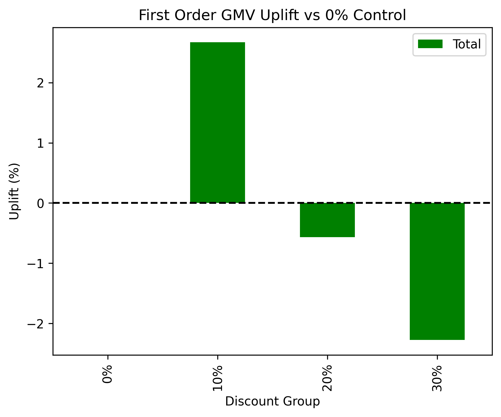

# First Order Discount A/B Test — Food Delivery Platform

## 🚀 Project Overview
This project explores how different discount strategies impact first-order conversion and gross merchandise value (GMV) on a food delivery platform. The goal is to identify the optimal discount rate to maximize new user acquisition and revenue.

---

## 🎯 Business Objective
- Improve first-order conversion rate
- Increase GMV per new user
- Identify the most cost-effective discount strategy

---

## 🧑‍💻 My Role
- Designed A/B testing strategy and defined success metrics
- Performed data cleaning and exploratory analysis
- Conducted hypothesis testing and uplift analysis
- Delivered business recommendations supported by visual insights

---

## 📊 Key Metrics Summary
- 📈 Overall uplift (10% discount vs. control): **+2.7% GMV**
- 💰 Best discount group: **10% discount group**
- 🛒 Total delivered first orders analyzed: **~11,000**
- 🎯 Recommended discount strategy: **Implement 10% first-order discount**

---

## 💡 GMV Distribution by Discount Group

---

## 📦 GMV Boxplot by Discount Group

---

## 🚀 Uplift Percentage Compared to Control

---

## ✅ Business Recommendation
Based on our A/B test results, a 10% discount delivers the highest GMV uplift (+2.7%) while avoiding excessive margin reduction. We recommend focusing on a 10% first-order discount to drive new user acquisition in a cost-efficient manner.

---

## 🛠 Tools & Skills
- Python (pandas, matplotlib, seaborn, statsmodels)
- SQL
- Statistical hypothesis testing
- Business impact analysis

---

## 📎 Data Source
- [Food Delivery Order History Dataset (Kaggle)](https://www.kaggle.com/datasets/sujalsuthar/food-delivery-order-history-data)

---

## ⚡ Future Work
- Analyze long-term retention impact post-discount
- Incorporate city or region segmentation to further refine the strategy
- Explore discount effects on repeat purchase behavior

---
